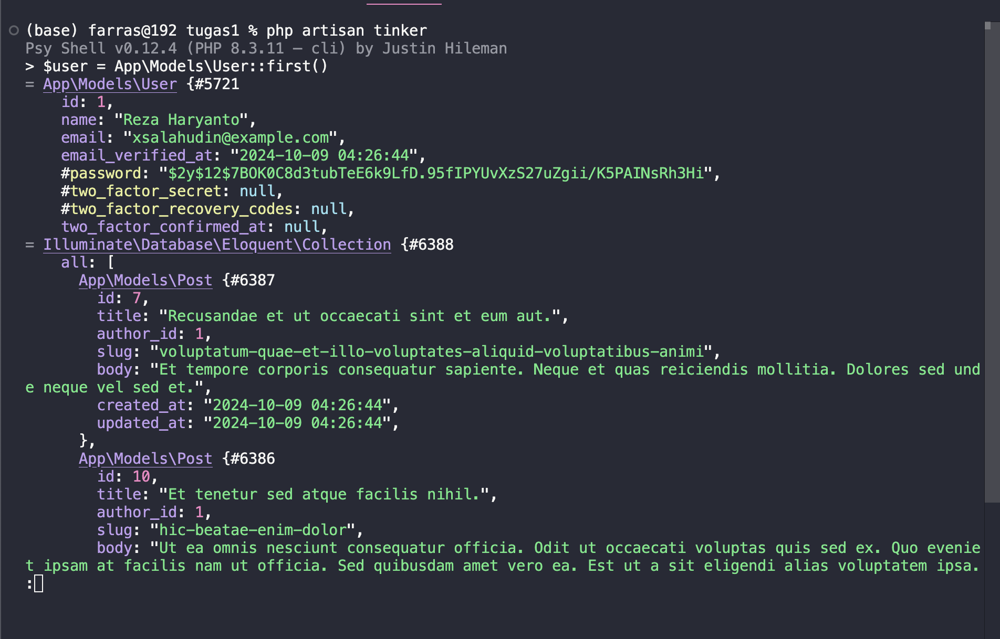
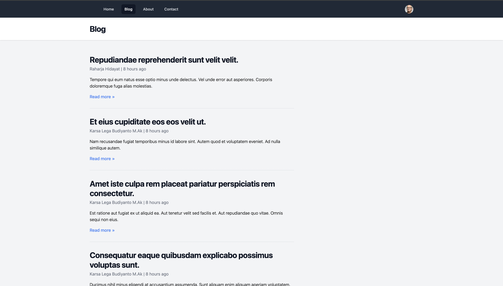
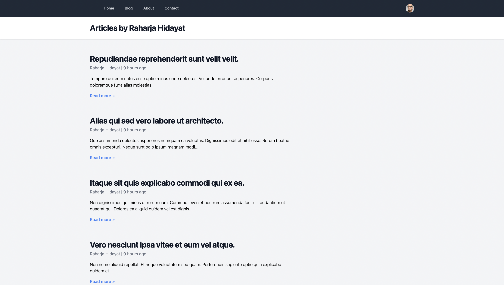

## Tugas PBKK 1
### Mengikuti tutorial laravel dan manambahkan UI baru

#### - Based on Tutorial

#### - Sebagai tambahan saya menambahkan sebuah header section dari tailwind yang berisi tentang profil saya yang diletakkan di page about pada bagian bawah halaman

### Melanjutkan tutorial laravel View data dan model 

#### - Saya juga telah membuat halaman 404 seperti yang ditunjukkan di video

### Melanjutkan tutorial laravel Database dan Eloquent ORM

#### - Saya membuat database posts yang ada ditutorial menggunakan mysql dan GUI phpmyadmin 

 ##### Berisi database default laravel dan table posts seperti yang ada di tutorial
 
#### - Saya mengikuti tutorial Eloquent ORM

 ### Melanjutkan tutorial Model Factories dan Eloquent Relationship

 #### Factory sudah berjalan dan diberi relationship seperti di tutorial

